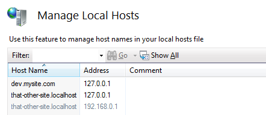

Host switching is a feature of Hosts File Manager that is intended to simplify switching one or more hostnames to a specific address while making minimal changes to the hosts file.

The Address Switching feature can also be applied to all the bindings of a particular site. See [Editing Site Binding Host Entries](Editing-Site-Binding-Host-Entries) for more details.

**Figure 1** shows an example scenario where switching can be used

The hostname _that-other-site.localhost_ has multiple host entries, but only one is enabled (the other is "disabled", or commented out). If either entry is selected, the "Switch Address" task group on the right will show the options outlined in **Figure 2**

# **Detected Address List** - Each disabled entry will appear in this list, enabling the selected hostnames to automatically be "switched" to the new address.
# **Custom Switch** - Displays a dialog in which the address to switch to can be entered.

By switching an address, the disabled entry with the specified address will be enabled (uncommented) and all other entries for the selected hosts will be disabled (commented out). If no entry exists for the selected address, a new entry will be added.
